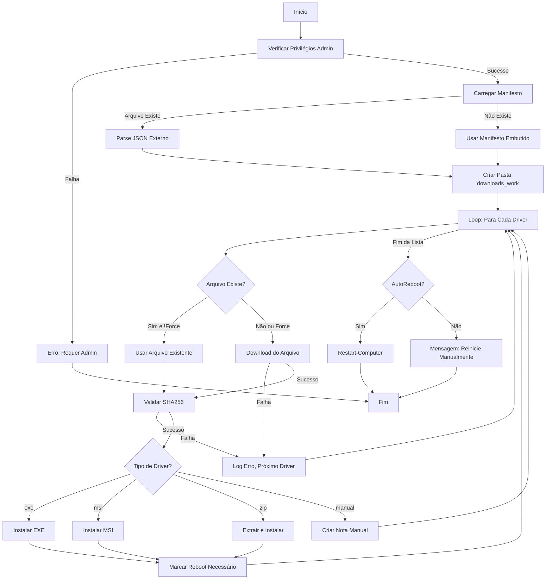

# Design Document — Silent Driver Installer

## Overview

O sistema de instalação silenciosa de drivers é implementado como um script Python multiplataforma que automatiza completamente o processo de download, validação e instalação de drivers para Windows e Linux. O design prioriza portabilidade, robustez, logging detalhado e experiência sem intervenção do usuário.

### Objetivos de Design

1. **Multiplataforma**: Funcionar identicamente em Windows e Linux
2. **Automação Completa**: Minimizar interação do usuário ao máximo
3. **Segurança**: Validar integridade de todos os downloads via SHA256
4. **Robustez**: Continuar processamento mesmo quando drivers individuais falham
5. **Rastreabilidade**: Log detalhado de todas as operações
6. **Flexibilidade**: Suportar múltiplos formatos de instalador (exe, msi, zip, deb, rpm)
7. **Portabilidade**: Python 3.7+ como única dependência principal

## Architecture

### Componentes Principais

```
┌─────────────────────────────────────────────────────────────┐
│                      setup-drivers.py                       │
│                   (Python 3.7+ Universal)                   │
│                                                             │
│  ┌────────────────┐  ┌──────────────┐  ┌─────────────────┐  │
│  │ Initialization │  │   Download   │  │   Installation  │  │
│  │    Module      │→ │    Module    │→ │     Module      │  │
│  │  - Check Admin │  │  - requests  │  │  - OS Detection │  │
│  │  - Check Python│  │  - SHA256    │  │  - Win/Linux    │  │
│  │  - Check Deps  │  │  - Retry     │  │  - Subprocess   │  │
│  └────────────────┘  └──────────────┘  └─────────────────┘  │
│          ↓                  ↓                    ↓          │
│  ┌────────────────────────────────────────────────────────┐ │
│  │         Logging & Error Handling (logging module)      │ │
│  └────────────────────────────────────────────────────────┘ │
└─────────────────────────────────────────────────────────────┘
                              ↓
                    ┌──────────────────┐
                    │  drivers.json    │
                    │   (Manifest)     │
                    └──────────────────┘
                              ↓
                    ┌──────────────────┐
                    │requirements.txt  │
                    │  - requests      │
                    │  - tqdm (opt)    │
                    └──────────────────┘
```

### Fluxo de Execução



## Components and Interfaces

### 1. Initialization Module

**Responsabilidades:**
- Validar versão do Python (3.7+)
- Verificar dependências do requirements.txt
- Detectar sistema operacional (Windows/Linux)
- Validar privilégios elevados (admin/root)
- Processar argumentos de linha de comando
- Carregar e validar manifesto JSON
- Criar estrutura de diretórios necessária

**Funções:**

```python
def check_python_version() -> bool:
    """Verifica se Python 3.7+ está instalado"""
    
def check_dependencies() -> bool:
    """Verifica se todas as dependências do requirements.txt estão instaladas"""
    
def detect_os() -> str:
    """Detecta sistema operacional (Windows/Linux)"""
    
def check_admin_privileges() -> bool:
    """Verifica se está rodando com privilégios elevados"""
```

**Argumentos do Script:**
- `--manifest` (string): Caminho para arquivo JSON (default: `./downloads/drivers.json`)
- `--auto-reboot` (flag): Se deve reiniciar automaticamente após instalações
- `--force` (flag): Se deve forçar re-download de arquivos existentes
- `--dry-run` (flag): Simula instalação sem executar
- `--verbose` (flag): Logging detalhado

### 2. Download Module

**Responsabilidades:**
- Baixar arquivos de URLs especificadas
- Gerenciar cache de arquivos já baixados
- Implementar timeout e retry logic
- Mostrar progresso de download (opcional com tqdm)

**Funções:**

```python
def download_file(url: str, output_path: str, max_retries: int = 3) -> bool:
    """
    Baixa arquivo da URL para o caminho especificado
    
    Args:
        url: URL completa do arquivo
        output_path: Caminho local onde salvar
        max_retries: Número máximo de tentativas
        
    Returns:
        True se sucesso, False se falha
    """
```

**Comportamento:**
- Usa biblioteca `requests` para downloads
- Timeout de 600 segundos por download
- Retry com backoff exponencial (1s, 2s, 4s)
- Barra de progresso com `tqdm` (opcional)
- Registra progresso no log
- Retorna status de sucesso/falha sem interromper script

### 3. Validation Module

**Responsabilidades:**
- Calcular hash SHA256 de arquivos
- Comparar com hash esperado do manifesto
- Registrar resultados de validação

**Funções:**

```python
def calculate_sha256(file_path: str) -> str:
    """Calcula hash SHA256 de um arquivo"""
    
def verify_hash(file_path: str, expected_hash: str) -> bool:
    """
    Valida integridade do arquivo via SHA256
    
    Args:
        file_path: Caminho do arquivo a validar
        expected_hash: Hash SHA256 esperado (pode ser None/vazio)
        
    Returns:
        True se válido ou sem hash esperado, False se inválido
    """
```

**Comportamento:**
- Usa `hashlib.sha256()` nativo do Python
- Se `expected_hash` é None ou vazio, registra aviso mas retorna `True`
- Comparação case-insensitive de hashes
- Registra hash calculado e esperado em caso de falha
- Leitura de arquivo em chunks para eficiência com arquivos grandes

### 4. Installation Module

**Responsabilidades:**
- Detectar sistems de diferenl
- Instalar drivers de diferentes tipos (exe, msi, zip, deb, rpm)
- Tentar múltiplos argumentos silenciosos
- Extrair e processar arquivos compactados
- Gerenciar instalações manuais

**Funções:**

```python
def detect_os() -> str:
    """Detecta sistema operacional (Windows/Linux)"""
    
def install_windows_exe(file_path: str, silent_args: str = None) -> tuple[bool, int]:
    """Instala executável Windows com argumentos silenciosos"""
    
def install_windows_msi(file_path: str) -> tuple[bool, int]:
    """Instala MSI no Windows"""
    
def install_linux_deb(file_path: str) -> tuple[bool, int]:
    """Instala pacote DEB no Linux (Debian/Ubuntu)"""
    
def install_linux_rpm(file_path: str) -> tuple[bool, int]:
    """Instala pacote RPM no Linux (Fedora/RHEL)"""
    
def instalriver(entry: dict, file_path: str, os_type: str) -> bool:
    """
    Instala driver baseado no tipo e sistema operacional
    
    Args:
        entry: Dicionário do manifesto (name, type, silentArgs)
        file_path: Caminho do arquivo a instalar
        os_type: Sistema operacional ('Windows' ou 'Linux')
        
    Returns:
        True se instalação bem-sucedida, False caso contrário
    """
}
```

**Estratégia de Instalação Silenciosa (EXE):**

Ordem de tentativa de argumentos:
1. `$entry.silentArgs` (se fornecido no manifesto)
2. `/S`
3. `/silent`
4. `/quiet`
5. `/verysilent`
6. `/s`
7. `/s /v"/qn"`
8. `/S /v"/qn"`

Se todas as tentativas falharem (código de saída ≠ 0), executa sem argumentos permitindo interação do usuário.

**Estratégia de Instalação MSI:**

```powershell
msiexec.exe /i "<arquivo>" /qn /norestart
```

- `/i`: Instalar
- `/qn`: Modo silencioso sem UI
- `/norestart`: Não reiniciar automaticamente

**Estratégia de Instalação ZIP:**

1. Extrair para pasta temporária em `$env:TEMP`
2. Buscar recursivamente por arquivos `*.exe` ou `*.msi`
3. Usar primeiro instalador encontrado (ordenado alfabeticamente)
4. Instalar usando estratégia apropriada (exe ou msi)
5. Limpar pasta temporária após instalação

**Instalações Manuais:**

Para entradas com `type: "manual"`:
- Criar arquivo `.manual.txt` em `downloads_work`
- Incluir nome do driver, URL e timestamp
- Não marcar como necessitando reboot

### 5. Logging Module

**Responsabilidades:**
- Registrar todas as operações em arquivo de log
- Exibir mensagens no console simultaneamente
- Formatar timestamps consistentemente

**Funções:**

```powershell
function Log($msg) {
    # Registra mensagem no log e exibe no console
    # Parâmetros:
    #   $msg: Mensagem a registrar
    # Retorna: void
}
```

**Formato de Log:**

```
[2025-11-10T14:30:45] Mensagem de log aqui
```

- Timestamp ISO 8601 (formato 's' do PowerShell)
- Arquivo: `windows\setup-drivers.log`
- Append mode (preserva logs de execuções anteriores)
- Saída duplicada para console via `Tee-Object`

## Data Models

### Manifest Entry Structure

```json
{
  "name": "Nome do Driver",
  "url": "https://exemplo.com/driver.exe",
  "fileName": "driver.exe",
  "sha256": "HASH_SHA256_EM_MAIUSCULAS",
  "type": "exe|msi|zip|manual",
  "silentArgs": "/S /v\"/qn\""
}
```

**Campos:**

- `name` (string, obrigatório): Nome descritivo do driver para logs
- `url` (string, obrigatório): URL completa para download
- `fileName` (string, obrigatório): Nome do arquivo a ser salvo localmente
- `sha256` (string, opcional): Hash SHA256 para validação (uppercase ou lowercase)
- `type` (string, obrigatório): Tipo de instalador (`exe`, `msi`, `zip`, `manual`)
- `silentArgs` (string, opcional): Argumentos de linha de comando para instalação silenciosa

**Validações:**

- `type` deve ser um dos valores: `exe`, `msi`, `zip`, `manual`
- `sha256` pode ser vazio/null mas é altamente recomendado
- `silentArgs` pode ser vazio/null (usa defaults para o tipo)

### Internal State Variables

```powershell
$Manifest        # String: Caminho do arquivo JSON
$AutoReboot      # Boolean: Se deve reiniciar automaticamente
$Force           # Boolean: Se deve forçar re-download
$manifestJson    # Array: Lista de objetos de driver parseados do JSON
$workDir         # String: Caminho da pasta downloads_work
$rebootNeeded    # Boolean: Flag indicando se reboot é necessário
```

## Error Handling

### Estratégia Geral

**Princípio:** Fail-soft — continuar processamento mesmo quando operações individuais falham.

### Categorias de Erro

#### 1. Erros Fatais (Terminam Script)

- **Falta de privilégios de administrador**
  - Código de saída: 1
  - Mensagem: "Este script precisa ser executado como Administrador. Abortando."

- **Falha ao parsear manifesto JSON**
  - Código de saída: 4
  - Mensagem: "Falha ao carregar o manifesto JSON: <detalhes>"

#### 2. Erros Recuperáveis (Continuam Processamento)

- **Falha no download**
  - Ação: Log erro, pular para próximo driver
  - Mensagem: "ERRO no download: <detalhes>"

- **Falha na validação de hash**
  - Ação: Log erro, pular instalação daquele driver
  - Mensagem: "Hash inválido para <arquivo>. Esperado: <hash> Encontrado: <hash>"

- **Falha na instalação**
  - Ação: Log erro, continuar com próximo driver
  - Mensagem: "Erro ao instalar <nome>: <detalhes>"

- **Nenhum instalador encontrado em ZIP**
  - Ação: Log aviso, continuar com próximo driver
  - Mensagem: "Nenhum instalador encontrado dentro do zip: <arquivo>"

### Try-Catch Blocks

```powershell
# Download
try {
    Invoke-WebRequest -Uri $url -OutFile $outPath -UseBasicParsing -TimeoutSec 600
    return $true
} catch {
    Log "ERRO no download: $_"
    return $false
}

# Instalação
try {
    Install-Item -entry $entry -filePath $outPath
} catch {
    Log "Erro ao instalar $($entry.name): $_"
}
```

### Logging de Erros

Todos os erros devem ser registrados com:
- Timestamp
- Contexto (qual driver, qual operação)
- Mensagem de erro detalhada do PowerShell (`$_`)
- Ação tomada (pular, continuar, abortar)

## Testing Strategy

### Testes Manuais

#### 1. Teste de Privilégios

**Objetivo:** Verificar que script detecta falta de privilégios admin

**Passos:**
1. Abrir PowerShell normal (não como admin)
2. Executar script
3. Verificar mensagem de erro e código de saída 1

**Resultado Esperado:** Script termina com erro claro

#### 2. Teste de Download

**Objetivo:** Verificar download e cache de arquivos

**Passos:**
1. Limpar pasta `downloads_work`
2. Executar script com manifesto contendo 1 driver
3. Verificar arquivo baixado em `downloads_work`
4. Executar script novamente sem `-Force`
5. Verificar que download foi pulado (log deve indicar)
6. Executar script com `-Force`
7. Verificar que arquivo foi baixado novamente

**Resultado Esperado:** 
- Primeira execução: download realizado
- Segunda execução: download pulado
- Terceira execução: download forçado

#### 3. Teste de Validação SHA256

**Objetivo:** Verificar detecção de arquivos corrompidos

**Passos:**
1. Criar manifesto com hash SHA256 correto
2. Executar script e verificar validação bem-sucedida
3. Modificar hash no manifesto para valor incorreto
4. Executar script novamente
5. Verificar que instalação foi pulada e erro registrado

**Resultado Esperado:**
- Hash correto: instalação prossegue
- Hash incorreto: instalação pulada, erro no log

#### 4. Teste de Instalação Silenciosa (EXE)

**Objetivo:** Verificar tentativas de argumentos silenciosos

**Passos:**
1. Usar driver exe conhecido (ex: Intel Chipset)
2. Executar script e monitorar log
3. Verificar quais argumentos foram tentados
4. Confirmar instalação bem-sucedida

**Resultado Esperado:** 
- Log mostra tentativas de argumentos
- Instalação completa sem prompts
- Código de saída 0 registrado

#### 5. Teste de Instalação MSI

**Objetivo:** Verificar instalação silenciosa de MSI

**Passos:**
1. Usar driver msi no manifesto
2. Executar script
3. Verificar comando msiexec no log
4. Confirmar instalação sem UI

**Resultado Esperado:**
- Comando msiexec com `/qn` executado
- Instalação completa silenciosamente

#### 6. Teste de Instalação ZIP

**Objetivo:** Verificar extração e instalação de ZIP

**Passos:**
1. Usar driver zip no manifesto
2. Executar script
3. Verificar extração para pasta temporária no log
4. Verificar detecção de instalador interno
5. Confirmar instalação do instalador interno

**Resultado Esperado:**
- ZIP extraído
- Instalador encontrado
- Instalação executada
- Pasta temporária limpa

#### 7. Teste de Entrada Manual

**Objetivo:** Verificar criação de nota para instalações manuais

**Passos:**
1. Adicionar entrada `type: "manual"` no manifesto
2. Executar script
3. Verificar criação de arquivo `.manual.txt` em `downloads_work`
4. Verificar conteúdo do arquivo

**Resultado Esperado:**
- Arquivo `.manual.txt` criado
- Contém nome, URL e timestamp
- Não marca reboot necessário

#### 8. Teste de Reinicialização

**Objetivo:** Verificar lógica de reinicialização

**Passos:**
1. Executar script sem `-AutoReboot`
2. Verificar mensagem de reinicialização manual
3. Executar script com `-AutoReboot:$true`
4. Verificar que `Restart-Computer` seria chamado (testar em VM)

**Resultado Esperado:**
- Sem AutoReboot: mensagem para reiniciar manualmente
- Com AutoReboot: sistema reinicia automaticamente

#### 9. Teste de Manifesto Embutido

**Objetivo:** Verificar fallback para manifesto embutido

**Passos:**
1. Renomear ou remover `drivers.json`
2. Executar script
3. Verificar log indicando uso de manifesto embutido
4. Verificar que driver Intel Chipset é processado

**Resultado Esperado:**
- Log indica manifesto embutido
- Driver exemplo é processado

#### 10. Teste de Erro de Parsing JSON

**Objetivo:** Verificar tratamento de JSON inválido

**Passos:**
1. Criar `drivers.json` com JSON malformado
2. Executar script
3. Verificar erro e código de saída 4

**Resultado Esperado:**
- Erro claro sobre falha no parsing
- Script termina com código 4

### Testes de Integração

#### Teste End-to-End Completo

**Objetivo:** Validar fluxo completo com múltiplos drivers

**Cenário:**
- Manifesto com 5 drivers: 2 exe, 1 msi, 1 zip, 1 manual
- 1 driver com hash incorreto (deve falhar)
- 1 driver com URL inválida (deve falhar)

**Passos:**
1. Preparar manifesto conforme cenário
2. Executar script como admin
3. Monitorar log em tempo real
4. Verificar Device Manager após conclusão

**Resultado Esperado:**
- 2 drivers instalados com sucesso (exe, msi)
- 1 driver zip extraído e instalado
- 1 nota manual criada
- 2 drivers falharam com erros registrados
- Log completo e detalhado
- Mensagem de reinicialização exibida

### Testes de Regressão

Após qualquer modificação no script, executar:
1. Teste de privilégios
2. Teste de download com cache
3. Teste de validação SHA256
4. Teste end-to-end com manifesto conhecido

### Ambiente de Teste

**Recomendado:**
- VM Windows 10/11 com snapshot limpo
- Placa-mãe Asus Prime Z590M-PLUS (ou similar)
- Conexão de internet estável
- Privilégios de administrador

**Ferramentas:**
- PowerShell 5.1+ ou PowerShell Core 7+
- Device Manager para verificar instalações
- Process Monitor (opcional) para debug

## Security Considerations

### 1. Validação de Integridade

- **Obrigatório:** Sempre incluir SHA256 no manifesto para drivers de produção
- **Risco:** Downloads sem hash podem ser adulterados (MITM attacks)
- **Mitigação:** Script avisa quando hash não é fornecido

### 2. Execução de Código

- **Risco:** Script executa instaladores baixados da internet
- **Mitigação:** 
  - Validação SHA256 garante integridade
  - URLs devem ser sempre de fontes oficiais (Intel, AMD, Realtek, ASUS)
  - Manifesto deve ser revisado antes de uso

### 3. Privilégios Elevados

- **Risco:** Script requer admin, pode causar danos se malicioso
- **Mitigação:**
  - Código aberto e auditável
  - Logging detalhado de todas as ações
  - Usuário deve revisar manifesto antes de executar

### 4. Armazenamento de Arquivos

- **Risco:** Arquivos baixados podem ser substituídos por malware
- **Mitigação:**
  - Validação SHA256 antes de instalação
  - Pasta `downloads_work` deve ter permissões restritas
  - Parâmetro `-Force` permite re-download se suspeita de corrupção

### 5. URLs e Downloads

- **Risco:** URLs podem redirecionar para sites maliciosos
- **Mitigação:**
  - Usar apenas URLs HTTPS de fornecedores oficiais
  - Validar certificados SSL (comportamento padrão do PowerShell)
  - Documentar fonte de cada URL no manifesto

### 6. Reinicialização Automática

- **Risco:** Reinicialização forçada pode causar perda de dados
- **Mitigação:**
  - AutoReboot é opt-in (switch parameter)
  - Aviso claro no log antes de reiniciar
  - Usuário deve salvar trabalho antes de executar com AutoReboot

## Performance Considerations

### Download Paralelo (Futuro)

**Atual:** Downloads sequenciais
**Melhoria Futura:** Usar `Start-Job` para downloads paralelos

```powershell
# Pseudocódigo
$jobs = @()
foreach ($entry in $manifestJson) {
    $jobs += Start-Job -ScriptBlock { Download-File $entry.url $entry.fileName }
}
$jobs | Wait-Job | Receive-Job
```

**Benefício:** Reduzir tempo total de download em 50-70%

### Cache Inteligente

**Atual:** Cache baseado em existência de arquivo
**Melhoria Futura:** Cache baseado em hash

```powershell
# Verificar se arquivo existe E hash corresponde
if ((Test-Path $outPath) -and (Verify-Hash $outPath $entry.sha256)) {
    # Usar cache
}
```

**Benefício:** Evitar uso de arquivos corrompidos em cache

### Instalação Paralela (Limitado)

**Restrição:** Muitos instaladores requerem exclusividade
**Possível:** Instalações que não conflitam (ex: drivers de diferentes dispositivos)

**Não Recomendado:** Complexidade vs benefício não justifica implementação

## Maintenance and Extensibility

### Adicionando Novos Tipos de Instalador

Para suportar novos formatos (ex: `.cab`, `.inf`):

1. Adicionar novo case no switch de `Install-Item`:

```powershell
'cab' {
    $cabArgs = "/add-driver `"$filePath`" /install"
    Log "Executando pnputil $cabArgs"
    $p = Start-Process -FilePath pnputil.exe -ArgumentList $cabArgs -Wait -PassThru
    if ($p.ExitCode -ne 0) { Log "pnputil retornou código $($p.ExitCode)" }
}
```

2. Documentar novo tipo no README
3. Adicionar testes para novo tipo

### Atualizando Manifesto

**Processo Recomendado:**

1. Identificar novo driver necessário
2. Baixar manualmente e calcular SHA256:
   ```powershell
   Get-FileHash -Algorithm SHA256 -Path driver.exe
   ```
3. Adicionar entrada no `drivers.json`:
   ```json
   {
     "name": "Novo Driver",
     "url": "https://...",
     "fileName": "driver.exe",
     "sha256": "HASH_CALCULADO",
     "type": "exe",
     "silentArgs": "/S"
   }
   ```
4. Testar em VM antes de usar em produção

### Versionamento do Manifesto

**Recomendação:** Usar Git para versionar `drivers.json`

```bash
git add windows/downloads/drivers.json
git commit -m "Add driver: Intel LAN I219-V v1.2.3"
git tag -a drivers-v1.0 -m "Stable driver set for Z590M-PLUS"
```

**Benefício:** Rastrear mudanças, reverter se necessário

## Documentation Requirements

### README Atualizado

Deve incluir:
- Instruções de uso do script
- Exemplos de execução
- Descrição de parâmetros
- Troubleshooting comum
- Como atualizar manifesto

### Comentários no Código

- Cada função deve ter comentário descrevendo propósito, parâmetros e retorno
- Seções complexas devem ter comentários explicativos
- Referências a requisitos específicos onde aplicável

### Changelog

Manter `CHANGELOG.md` com:
- Data de cada versão
- Mudanças funcionais
- Correções de bugs
- Drivers adicionados/removidos do manifesto

## Future Enhancements

### 1. Interface Gráfica (GUI)

- Usar Windows Forms ou WPF
- Mostrar progresso de downloads
- Permitir seleção de drivers a instalar
- Preview de log em tempo real

### 2. Detecção Automática de Hardware

- Usar `Get-PnpDevice` para listar hardware
- Comparar com manifesto
- Instalar apenas drivers necessários

```powershell
$devices = Get-PnpDevice | Where-Object { $_.Status -eq 'Unknown' }
# Mapear para drivers no manifesto
```

### 3. Verificação de Versão

- Comparar versão instalada vs disponível
- Pular se versão atual é mais recente
- Suportar downgrade se necessário

### 4. Rollback de Drivers

- Backup de drivers antes de atualizar
- Função para restaurar drivers anteriores
- Integração com System Restore

### 5. Suporte a Driver Packs

- Baixar e processar driver packs da ASUS
- Extrair apenas drivers necessários
- Reduzir tamanho de download

### 6. Notificações

- Enviar email ao completar
- Integração com Slack/Teams
- Notificações Windows 10/11

### 7. Agendamento

- Criar Scheduled Task para execução periódica
- Verificar atualizações de drivers automaticamente
- Instalar durante janela de manutenção

### 8. Relatório HTML

- Gerar relatório visual após instalação
- Incluir status de cada driver
- Gráficos de sucesso/falha
- Exportar para compartilhamento

## Deployment

### Pré-requisitos

- Windows 10/11 (64-bit)
- PowerShell 5.1 ou superior
- Privilégios de administrador
- Conexão com internet

### Estrutura de Arquivos

```
windows/
├── setup-drivers-windows.ps1    # Script principal
├── downloads/
│   └── drivers.json              # Manifesto de drivers
├── downloads_work/               # Pasta de trabalho (criada automaticamente)
│   ├── SetupChipset.exe
│   ├── AMD_Adrenalin_Web.exe
│   └── *.manual.txt
└── setup-drivers.log             # Log de execução
```

### Instalação

1. Clonar repositório ou baixar arquivos
2. Revisar e atualizar `drivers.json` conforme necessário
3. Abrir PowerShell como Administrador
4. Navegar para pasta `windows`
5. Executar:
   ```powershell
   Set-ExecutionPolicy -Scope Process -ExecutionPolicy Bypass
   .\setup-drivers-windows.ps1
   ```

### Configuração

**Parâmetros Comuns:**

```powershell
# Instalação padrão (sem reboot automático)
.\setup-drivers-windows.ps1

# Com reboot automático
.\setup-drivers-windows.ps1 -AutoReboot

# Forçar re-download
.\setup-drivers-windows.ps1 -Force

# Manifesto customizado
.\setup-drivers-windows.ps1 -Manifest "C:\custom\drivers.json"

# Combinação
.\setup-drivers-windows.ps1 -Manifest ".\custom.json" -Force -AutoReboot
```

### Troubleshooting Deployment

**Erro: "Execution Policy"**
```powershell
Set-ExecutionPolicy -Scope Process -ExecutionPolicy Bypass
```

**Erro: "Manifesto não encontrado"**
- Verificar caminho do arquivo
- Usar caminho absoluto se necessário
- Verificar permissões de leitura

**Erro: "Acesso negado"**
- Executar PowerShell como Administrador
- Verificar UAC não está bloqueando

**Downloads lentos**
- Verificar conexão de internet
- Considerar aumentar timeout no código
- Baixar manualmente e usar cache

## Conclusion

Este design fornece uma solução robusta e extensível para instalação automatizada de drivers no Windows. A arquitetura modular permite fácil manutenção e adição de novos recursos, enquanto o foco em logging e tratamento de erros garante rastreabilidade e confiabilidade.

A implementação prioriza segurança através de validação SHA256 e experiência do usuário através de instalações silenciosas e reinicialização única ao final do proces